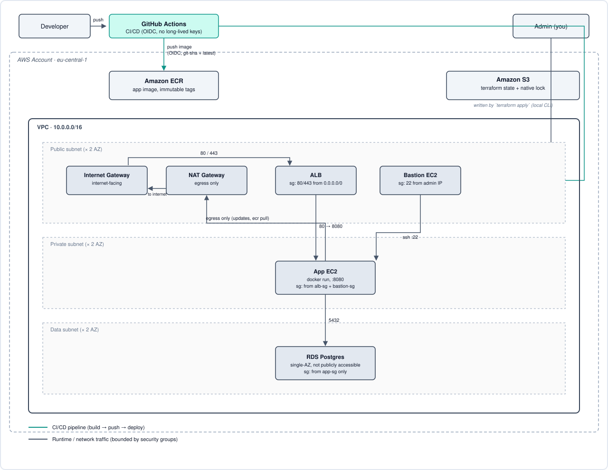

# Production-Grade GitOps Platform

An end-to-end, highly available cloud-native platform deployed on AWS. This repository demonstrates a complete DevOps lifecycle, from Infrastructure as Code (IaC) to automated CI/CD pipelines, container orchestration, and GitOps continuous delivery.

## 🗺️ Architecture



Traffic is bounded by security groups at every hop: the ALB accepts public HTTP/HTTPS, the app server only accepts traffic from the ALB and the bastion, and RDS only accepts traffic from the app server. The app server and database sit in private/data subnets with no direct internet inbound.

## 🏗️ Architecture & Tech Stack

- **Cloud Provider:** AWS
- **Infrastructure as Code:** Terraform
- **Containerization:** Docker (Multi-stage Alpine builds)
- **CI/CD:** GitHub Actions (with AWS OIDC Federation)
- **Container Registry:** Amazon ECR
- **Orchestration & Delivery (Upcoming):** Amazon EKS, Helm, ArgoCD
- **Observability (Upcoming):** Prometheus, Grafana, Loki
- **Security (Upcoming):** Trivy, Checkov

---

## 🚀 Current Implementation Status

### Phase 1: Terraform Foundation (Completed)
Architected a resilient, multi-tier AWS network topology using decoupled Terraform modules.
- **Networking:** Provisioned isolated Public, Private, and Data subnets across multiple Availability Zones.
- **Security:** Deployed a strict Bastion proxy jump and minimal-privilege Security Groups.
- **Data Layer:** Provisioned a secure, private RDS PostgreSQL instance.
- **State Management:** Implemented remote state via Amazon S3 with versioning and state locking to prevent execution collisions.

### Phase 2: Containers & CI/CD (Completed)
Engineered an automated, zero-trust deployment pipeline.
- **Dockerization:** Wrote multi-stage Dockerfiles optimizing build caching and reducing the final production image footprint by over 60%.
- **OIDC Authentication:** Configured GitHub Actions to assume temporary AWS IAM roles via OpenID Connect, eliminating long-lived credentials from repository secrets.
- **Automated Pipeline:** Structured a strict quality gate pipeline (Test → Build → Push → Deploy) that tags images with immutable git-SHAs, pushes them to Amazon ECR, then runs an Ansible playbook (SSH via the bastion) to pull and run the new image on the app server.

---

## 🗺️ Project Roadmap

This project is being developed in iterative phases to mimic a real-world enterprise platform rollout:

- [x] **Phase 1:** AWS Infrastructure Foundation (Terraform)
- [x] **Phase 2:** Containerization & Continuous Integration (Docker, GH Actions, ECR)
- [x] **Phase 2.5:** Ephemeral Dev Environment (foundation/environment state split, on-demand + scheduled destroy)
- [ ] **Phase 3:** Kubernetes on EKS (Provisioning cluster, deploying via Helm) — *built and verified on a real cluster; EC2 path not removed yet*
- [ ] **Phase 4:** GitOps Continuous Delivery (Decoupling CI/CD with ArgoCD) — *built and verified on a real cluster*
- [ ] **Phase 5:** Observability Stack (Metrics and log aggregation via Prometheus/Grafana)
- [ ] **Phase 6:** DevSecOps (Integrating Trivy image scanning and Checkov IaC analysis)
- [ ] **Phase 7:** Platform Polish & Cost Optimization

---

## 📂 Repository Structure

```text
.
├── .github/
│   └── workflows/
│       ├── ci.yml                # App pipeline (Test, Build, Push to ECR, Deploy)
│       ├── helm-chart.yml        # Chart quality gate (lint, schema, kube-score)
│       └── terraform*.yml        # Plan/apply, manual up/down, nightly destroy
├── app/                          # Application source code
│   ├── Dockerfile                # Multi-stage production container
│   ├── docker-compose.yml        # Local development environment
│   └── ...
├── helm/
│   ├── app/                      # Hardened Helm chart for the app (see its README)
│   └── scripts/validate-chart.sh # The chart gate, identical locally and in CI
└── terraform/
    ├── environments/
    │   ├── foundation/           # Persistent: OIDC, CI roles, ECR. Applied by CI on merge.
    │   └── dev/                  # Ephemeral: VPC, compute, RDS. Destroyed/recreated freely.
    └── modules/
        ├── foundation-iam/       # OIDC provider, CI roles (github, tf-plan, tf-apply, foundation-apply)
        ├── ecr/                  # App image registry
        ├── compute-iam/          # SSH key pair, EC2 instance role
        ├── compute/              # Bastion, App instances, ALB
        ├── eks/                  # EKS cluster, managed node group, access entries, VPC CNI add-on, IRSA OIDC
        ├── lb-controller/        # AWS Load Balancer Controller + its IRSA role
        ├── argocd/               # Argo CD + root app-of-apps, installed by Terraform
        ├── data/                 # RDS Postgres
        ├── networking/           # VPC, Subnets, IGW, NAT
        └── security-groups/      # Stateful firewall rules

```

Two Terraform states, on purpose: `foundation` holds what CI itself depends on to run — if it lived in the same state as the ephemeral environment, destroying the environment would delete the very roles needed to bring it back. `dev` is the only environment wired up beyond that; a `prod` environment would be added the same way (reusing the shared modules) when it's actually needed.

---

## 🛠️ Usage & Deployment

### Infrastructure Deployment

The infrastructure is modular and managed via Terraform, split across two states. Neither config hardcodes an AWS profile (CI authenticates via OIDC-assumed credentials in its environment, not a named profile), so for local runs set one yourself first:
```bash
export AWS_PROFILE=sofa
```

**1. Foundation — once, manually, before anything else:**
```bash
cd terraform/environments/foundation
terraform init
terraform plan -out=tfplan
terraform apply tfplan
```
This creates the GitHub OIDC provider, the three CI roles, and the ECR repo. It's applied by hand (not via CI) since CI's own permission to run Terraform comes from the roles this step creates.

**2. Dev environment — as often as you like:**
```bash
cd terraform/environments/dev
terraform init
terraform plan -out=tfplan
terraform apply tfplan
```


### CI/CD Pipeline

The GitHub Actions workflow triggers automatically on pushes and pull requests to the `main` branch. It executes local tests, builds the Docker image utilizing the GitHub Actions cache (`type=gha`), authenticates to AWS via OIDC, and pushes the immutable artifact to ECR. On a push (not PRs), a final `deploy` job runs the Ansible `app_servers` playbook over SSH via the bastion to pull and run the new image on the app server.

The deploy job needs one additional repository secret beyond `ECR_REPOSITORY_URL` and `AWS_ACCOUNT_ID`:

- `BASTION_SSH_PRIVATE_KEY` — the private half of the `gitops-platform` key pair registered in the `compute-iam` module, used to SSH-proxy through the bastion to the private app server.

### Terraform Pipeline

A second workflow ([`terraform.yml`](.github/workflows/terraform.yml)) plans and applies infrastructure changes:

- **Any PR touching the `dev` environment or the modules it uses** runs `terraform plan` using a **read-only** OIDC role (`gitops-platform-tf-plan-role`) and posts the plan as a PR comment — safe even on a PR from a fork, since it can't change anything. Changes to `foundation` have their own pipeline (`terraform-foundation.yml`): plan on the PR, apply on merge to `main` with no approval gate, using a role that only trusts `main`.
- **A push to `main`** re-runs that same read-only plan, uploads it as an artifact, then a second job downloads it and runs `terraform apply` on the *exact* reviewed plan using a separate, more privileged OIDC role (`gitops-platform-tf-apply-role`). That job targets the `dev` GitHub Environment, which requires manual approval before it's allowed to run — merging to `main` never silently changes infrastructure.

Since Terraform now runs on a GitHub Actions runner instead of your laptop, two values that used to come from your local machine have to come from repo config instead:

- `SSH_PUBLIC_KEY` (**repository variable**, not secret — it's a public key) — the contents of `~/.ssh/gitops-platform.pub`. The `aws_key_pair` resource used to read this from a local file path via `file()`, which doesn't exist on a CI runner.
- `ADMIN_IP` (**repository secret**) — your IP in `x.x.x.x/32` form, for the bastion's SSH ingress rule. This used to be fetched live via an HTTP call to whatever machine ran `terraform apply` — harmless locally, but in CI that machine is a GitHub-hosted runner with a random, constantly-changing IP, which would have silently locked the bastion to the wrong address on every run.

### Ephemeral Dev Environment

This is a learning project — there's no reason to pay for a VPC/NAT/ALB/RDS that sits idle. The `dev` environment (network, compute, database) is designed to be destroyed and recreated on demand, while `foundation` (CI roles, ECR) stays up permanently so tearing `dev` down never breaks the pipeline.

Three ways it gets torn down or spun up:

- **On demand** — [`terraform-manage.yml`](.github/workflows/terraform-manage.yml), a `workflow_dispatch` workflow. From the Actions tab, run it and pick `apply` or `destroy`. Gated behind the same `dev` environment approval as everything else.
- **Automatically on merge** — the existing Terraform pipeline (above) applies on every push to `main`, so merging a change brings the environment up if it's down.
- **Automatically every night** — [`terraform-nightly-destroy.yml`](.github/workflows/terraform-nightly-destroy.yml) tears it down on a schedule, **unattended, without the approval gate** — that's deliberate: a safety net for forgetting only works if it doesn't wait for you to approve it. It no-ops harmlessly if the environment's already down.

Caveat worth knowing: RDS is created with `skip_final_snapshot = true`, so **every teardown deletes the database with no backup**. Fine for a learning environment with disposable data; not a pattern to carry into anything real.

### Kubernetes and GitOps (in progress)

The EC2 path is being replaced by Kubernetes in stages; it stays live until the new path is proven.

- **Cluster:** `terraform/modules/eks` creates the EKS control plane and a managed node group. Access is only through EKS access entries (CI apply role as admin, CI plan role read-only, plus `EKS_ADMIN_PRINCIPALS`); the creator is not an implicit admin. The VPC CNI add-on enforces NetworkPolicy.
- **Ingress:** the AWS Load Balancer Controller (`terraform/modules/lb-controller`, IRSA) turns the chart's Ingress into an internet-facing ALB. It is installed by Terraform, not Argo CD, so it is destroyed after the apps and can still delete their load balancers.
- **Packaging:** [`helm/app`](helm/app) is a hardened chart, gated in CI by [`helm-chart.yml`](.github/workflows/helm-chart.yml).
- **Delivery:** Terraform installs Argo CD and a root Application right after the cluster. Argo CD reads [`gitops-platform-config`](https://github.com/joue-zero/gitops-platform-config) (app, metrics-server for the HPA), so a recreated environment rebuilds itself from Git.
- **Releases:** after each image push, the `update-gitops` job in [`ci.yml`](.github/workflows/ci.yml) commits the new image tag to the config repo, and Argo CD rolls it out. A rollback is a `git revert` there.

Verified on a real cluster: the pods run under the `restricted` Pod Security profile, a release and a rollback through Git each take seconds, manual drift is reverted, the HPA reads metrics, NetworkPolicy blocks outbound traffic while allowing DNS, and the ALB serves `/health` from the internet.

Before relying on it:

1. `foundation` is applied by CI on merge; by hand only for the first bootstrap or to recover a broken role.
2. Add a `GITOPS_CONFIG_TOKEN` repository secret: a fine-grained token with *Contents: read and write* on `gitops-platform-config` only. Without it the `update-gitops` job fails with a clear message.
3. Optionally set the `EKS_ADMIN_PRINCIPALS` repository variable (comma-separated IAM ARNs) to use `kubectl` on a CI-created cluster.

Then remove the EC2 path (`compute`, the `nginx`/`docker`/`app-deploy` Ansible roles, the CI deploy job) in one separate change.

### Branching Strategy

Trunk-based, not GitFlow: one long-lived `main` branch, short-lived feature branches merged via PR. Environments are promotion targets gated by required reviewers on a GitHub Environment (`dev` today; `prod` the same way once it exists), not separate long-lived branches — this matches the GitOps direction the later phases (ArgoCD) are already headed in.

